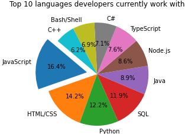
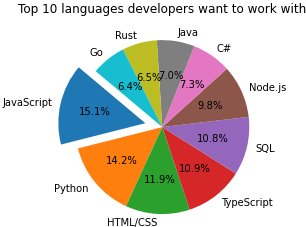

# Most Widely Used Programming Languages
 

Project Narrative
The objective of this project is to determine which programming language is the most popular among the tech community. Our data source was derived from the raw .csv file included in the Stack Overflow Developer Survey 2021: https://insights.stackoverflow.com/survey.

Hypothesis: Javascript is the most widely used language in the tech community.

Questions
1. Does age affect the programming language used?
2. Is there a preference amongst the genders?
3. Around the world, are there language preferences based on counntry?
4. Specifically in the US, are there language preferences in the different   states?

         

  

  

Project Organizers:
Marquestta Valdez : Visualizations
Steve DeNoia : Repository Manager/Data Cleanup
George Vallejo: ReadMe and Final Analysis
Mindy Garcia : Data Cleanup