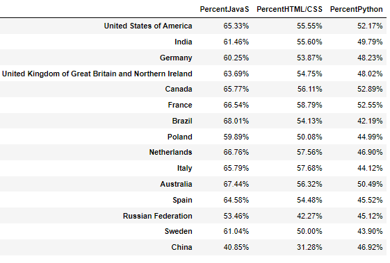

# Most Widely Used Programming Languages
 

# Project Narrative
The objective of this project is to determine which programming language is the most popular among the tech community. Our data source was derived from the raw .csv file included in the Stack Overflow Developer Survey 2021: https://insights.stackoverflow.com/survey.

Hypothesis: Javascript is the most widely used language in the tech community.

# Questions
1.  Is there a preference amongst the genders?
2. Does age affect the programming language used?
3. Around the world, which countries utilized the most used programming language ?
4. Specifically in the US, which state used the most commonly used programming language the most?

# Reports
The pie chart shows that Java Script is the most used programming lanugage of the 85,000 individuals surveyed. The pie charts also show that Java Script is the programming language that coders most want to work with.

  

In the bar graph we are showing how the majority of the people surveyed, who used java script, were male. 

Here we are comparing the age range of the participants who used Java Script.

# Percentage of Respondants Who Used Different Programmin Languages
Using 3 dataframes that showed the percent of languages used per country, we were able to merge some data that showed which of the 3 top languages were used most by each country. This image shows that Java Script is the most used programming language in the top 15 countries with the most respondants, except for China. China respondant's used Python more than any other programming language.

# Number of Respondants Who Used Java Script Per Country

Once it was determined that Java Script was the programming language that was used the most, we used a bar chart to show how many respondants used Java Script per country. Our data showed that the United States had the most respondants who used Java Script followed by India and Germany.

  
# Number of Respondants Who Used Java Script Per State

This bar chart shows how many repondant in each state use Java Script. 

Project Organizers:
Marquetta Valdez : Visualizations
Steve DeNoia : Repository Manager/Data Cleanup
George Vallejo: ReadMe and Final Analysis
Mindy Garcia : Data Cleanup
